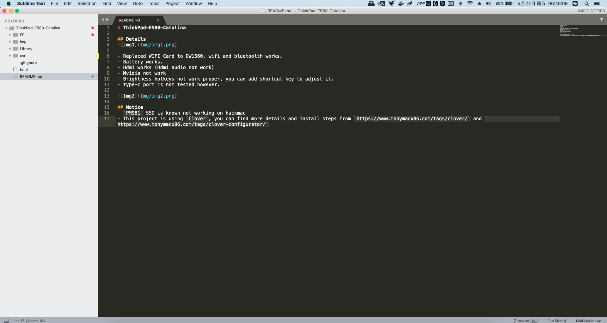
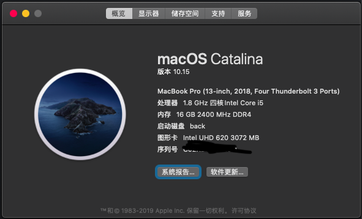
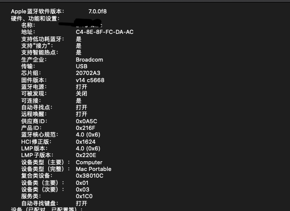

# ThinkPad-E580-Catalina

## Details

- Replaced WIFI Card to DW1560, wifi and bluetoolth works.
- Battery works.
- Hdmi works (Hdmi audio not work)
- Nvidia not work
- ** Brightness hotkeys not work proper, you can add shortcut key to adjust it ** .
- type-c port is not tested however.

## Notice
- `PM981` SSD is known not working on hackmac
- This project is using `Clover`, you can find more details and install steps from `https://www.tonymacx86.com/tags/clover/` and `https://www.tonymacx86.com/tags/clover-configurator/`